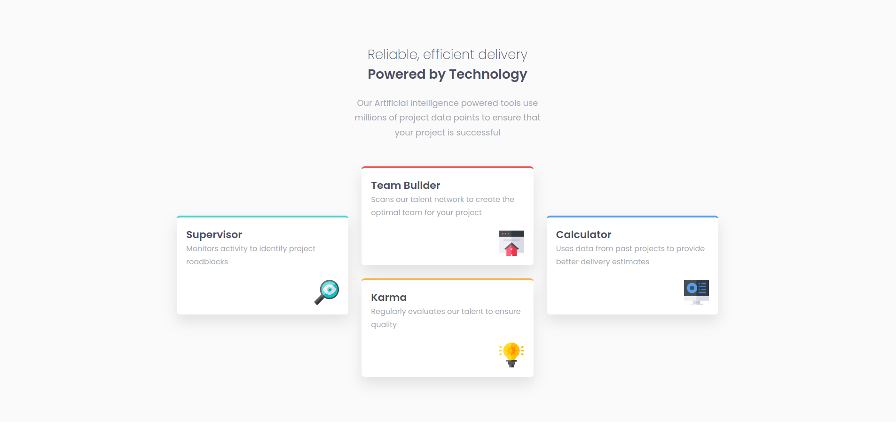

# Four card feature section solution

This is a solution to the [Four card feature section challenge on Frontend Mentor](https://www.frontendmentor.io/challenges/four-card-feature-section-weK1eFYK).

## Overview

### The challenge

Users should be able to:

- View the optimal layout for the site depending on their device's screen size

### Screenshot

### Links

- [Solution](https://www.frontendmentor.io/solutions/four-card-feature-section-urwbk9DRW9)
- [Live Site](https://mikhail-gulak.github.io/four-card-feature-section/)

## My process

### Built with

### What I learned

- How to use css "transform" property
